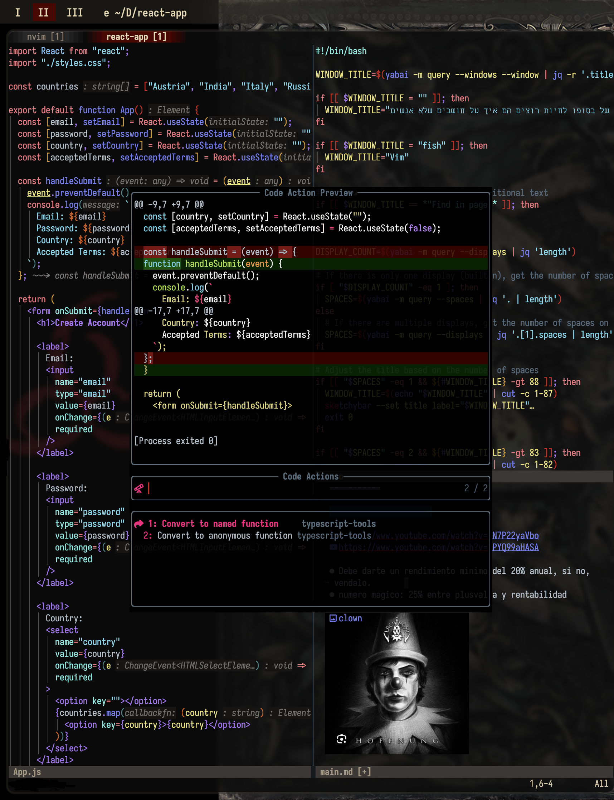

# Sergiornelas Neovim

<div align="center">

[]()
[]()
[](https://github.com/neovim/neovim)
<br>
<a href="https://dotfyle.com/sergiornelas/nvim"></a>
<a href="https://dotfyle.com/sergiornelas/nvim"></a>
<a href="https://dotfyle.com/sergiornelas/nvim"></a>

</div>

## Showcase




## Install Instructions

 > Install requires Neovim 0.9+. Always review the code before installing a configuration.

Clone the repository and install the plugins:

```sh
git clone git@github.com:sergiornelas/nvim ~/.config/sergiornelas/nvim
```

Open Neovim with this config:

```sh
NVIM_APPNAME=sergiornelas/nvim/ nvim
```

## Plugins

### ai

+ [monkoose/neocodeium](https://dotfyle.com/plugins/monkoose/neocodeium)
### bars-and-lines

+ [SmiteshP/nvim-navic](https://dotfyle.com/plugins/SmiteshP/nvim-navic)
### code-runner

+ [CRAG666/code_runner.nvim](https://dotfyle.com/plugins/CRAG666/code_runner.nvim)
### color

+ [brenoprata10/nvim-highlight-colors](https://dotfyle.com/plugins/brenoprata10/nvim-highlight-colors)
### colorscheme

+ [rebelot/kanagawa.nvim](https://dotfyle.com/plugins/rebelot/kanagawa.nvim)
+ [eldritch-theme/eldritch.nvim](https://dotfyle.com/plugins/eldritch-theme/eldritch.nvim)
+ [catppuccin/nvim](https://dotfyle.com/plugins/catppuccin/nvim)
+ [sainnhe/gruvbox-material](https://dotfyle.com/plugins/sainnhe/gruvbox-material)
+ [ribru17/bamboo.nvim](https://dotfyle.com/plugins/ribru17/bamboo.nvim)
+ [AlexvZyl/nordic.nvim](https://dotfyle.com/plugins/AlexvZyl/nordic.nvim)
+ [rose-pine/neovim](https://dotfyle.com/plugins/rose-pine/neovim)
+ [sainnhe/edge](https://dotfyle.com/plugins/sainnhe/edge)
+ [navarasu/onedark.nvim](https://dotfyle.com/plugins/navarasu/onedark.nvim)
+ [sho-87/kanagawa-paper.nvim](https://dotfyle.com/plugins/sho-87/kanagawa-paper.nvim)
+ [0xstepit/flow.nvim](https://dotfyle.com/plugins/0xstepit/flow.nvim)
+ [EdenEast/nightfox.nvim](https://dotfyle.com/plugins/EdenEast/nightfox.nvim)
+ [folke/tokyonight.nvim](https://dotfyle.com/plugins/folke/tokyonight.nvim)
+ [craftzdog/solarized-osaka.nvim](https://dotfyle.com/plugins/craftzdog/solarized-osaka.nvim)
+ [scottmckendry/cyberdream.nvim](https://dotfyle.com/plugins/scottmckendry/cyberdream.nvim)
### comment

+ [folke/ts-comments.nvim](https://dotfyle.com/plugins/folke/ts-comments.nvim)
### completion

+ [hrsh7th/nvim-cmp](https://dotfyle.com/plugins/hrsh7th/nvim-cmp)
### cursorline

+ [RRethy/vim-illuminate](https://dotfyle.com/plugins/RRethy/vim-illuminate)
### editing-support

+ [tummetott/unimpaired.nvim](https://dotfyle.com/plugins/tummetott/unimpaired.nvim)
+ [andersevenrud/nvim_context_vt](https://dotfyle.com/plugins/andersevenrud/nvim_context_vt)
+ [tzachar/highlight-undo.nvim](https://dotfyle.com/plugins/tzachar/highlight-undo.nvim)
+ [windwp/nvim-autopairs](https://dotfyle.com/plugins/windwp/nvim-autopairs)
+ [nvim-treesitter/nvim-treesitter-context](https://dotfyle.com/plugins/nvim-treesitter/nvim-treesitter-context)
### file-explorer

+ [stevearc/oil.nvim](https://dotfyle.com/plugins/stevearc/oil.nvim)
### formatting

+ [stevearc/conform.nvim](https://dotfyle.com/plugins/stevearc/conform.nvim)
+ [lewis6991/spaceless.nvim](https://dotfyle.com/plugins/lewis6991/spaceless.nvim)
### fuzzy-finder

+ [crispgm/telescope-heading.nvim](https://dotfyle.com/plugins/crispgm/telescope-heading.nvim)
+ [nvim-telescope/telescope.nvim](https://dotfyle.com/plugins/nvim-telescope/telescope.nvim)
### game

+ [seandewar/killersheep.nvim](https://dotfyle.com/plugins/seandewar/killersheep.nvim)
### git

+ [lewis6991/gitsigns.nvim](https://dotfyle.com/plugins/lewis6991/gitsigns.nvim)
+ [sindrets/diffview.nvim](https://dotfyle.com/plugins/sindrets/diffview.nvim)
### icon

+ [echasnovski/mini.icons](https://dotfyle.com/plugins/echasnovski/mini.icons)
+ [nvim-tree/nvim-web-devicons](https://dotfyle.com/plugins/nvim-tree/nvim-web-devicons)
+ [allaman/emoji.nvim](https://dotfyle.com/plugins/allaman/emoji.nvim)
### indent

+ [lukas-reineke/indent-blankline.nvim](https://dotfyle.com/plugins/lukas-reineke/indent-blankline.nvim)
+ [echasnovski/mini.indentscope](https://dotfyle.com/plugins/echasnovski/mini.indentscope)
### lsp

+ [neovim/nvim-lspconfig](https://dotfyle.com/plugins/neovim/nvim-lspconfig)
+ [kosayoda/nvim-lightbulb](https://dotfyle.com/plugins/kosayoda/nvim-lightbulb)
+ [rachartier/tiny-inline-diagnostic.nvim](https://dotfyle.com/plugins/rachartier/tiny-inline-diagnostic.nvim)
+ [aznhe21/actions-preview.nvim](https://dotfyle.com/plugins/aznhe21/actions-preview.nvim)
+ [j-hui/fidget.nvim](https://dotfyle.com/plugins/j-hui/fidget.nvim)
+ [onsails/lspkind.nvim](https://dotfyle.com/plugins/onsails/lspkind.nvim)
+ [rachartier/tiny-code-action.nvim](https://dotfyle.com/plugins/rachartier/tiny-code-action.nvim)
### lsp-installer

+ [williamboman/mason.nvim](https://dotfyle.com/plugins/williamboman/mason.nvim)
### lua-colorscheme

+ [ellisonleao/gruvbox.nvim](https://dotfyle.com/plugins/ellisonleao/gruvbox.nvim)
### markdown-and-latex

+ [MeanderingProgrammer/render-markdown.nvim](https://dotfyle.com/plugins/MeanderingProgrammer/render-markdown.nvim)
+ [iamcco/markdown-preview.nvim](https://dotfyle.com/plugins/iamcco/markdown-preview.nvim)
### marks

+ [cbochs/grapple.nvim](https://dotfyle.com/plugins/cbochs/grapple.nvim)
### media

+ [3rd/image.nvim](https://dotfyle.com/plugins/3rd/image.nvim)
+ [HakonHarnes/img-clip.nvim](https://dotfyle.com/plugins/HakonHarnes/img-clip.nvim)
### nvim-dev

+ [nvim-lua/plenary.nvim](https://dotfyle.com/plugins/nvim-lua/plenary.nvim)
### plugin-manager

+ [folke/lazy.nvim](https://dotfyle.com/plugins/folke/lazy.nvim)
### programming-languages-support

+ [dmmulroy/ts-error-translator.nvim](https://dotfyle.com/plugins/dmmulroy/ts-error-translator.nvim)
+ [dmmulroy/tsc.nvim](https://dotfyle.com/plugins/dmmulroy/tsc.nvim)
### quickfix

+ [kevinhwang91/nvim-bqf](https://dotfyle.com/plugins/kevinhwang91/nvim-bqf)
+ [stevearc/quicker.nvim](https://dotfyle.com/plugins/stevearc/quicker.nvim)
### session

+ [rmagatti/auto-session](https://dotfyle.com/plugins/rmagatti/auto-session)
### snippet

+ [rafamadriz/friendly-snippets](https://dotfyle.com/plugins/rafamadriz/friendly-snippets)
+ [L3MON4D3/LuaSnip](https://dotfyle.com/plugins/L3MON4D3/LuaSnip)
### statusline

+ [nvim-lualine/lualine.nvim](https://dotfyle.com/plugins/nvim-lualine/lualine.nvim)
### syntax

+ [nvim-treesitter/nvim-treesitter](https://dotfyle.com/plugins/nvim-treesitter/nvim-treesitter)
+ [kylechui/nvim-surround](https://dotfyle.com/plugins/kylechui/nvim-surround)
+ [nvim-treesitter/nvim-treesitter-textobjects](https://dotfyle.com/plugins/nvim-treesitter/nvim-treesitter-textobjects)
### test

+ [nvim-neotest/neotest](https://dotfyle.com/plugins/nvim-neotest/neotest)
## Language Servers

+ cssls
+ eslint
+ flow
+ html
+ jsonls
+ lua_ls
