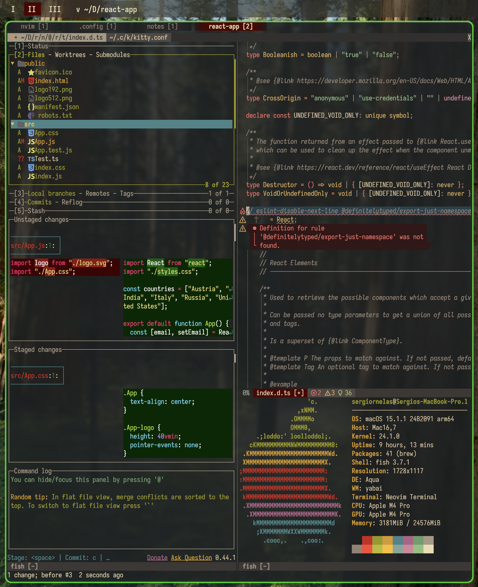
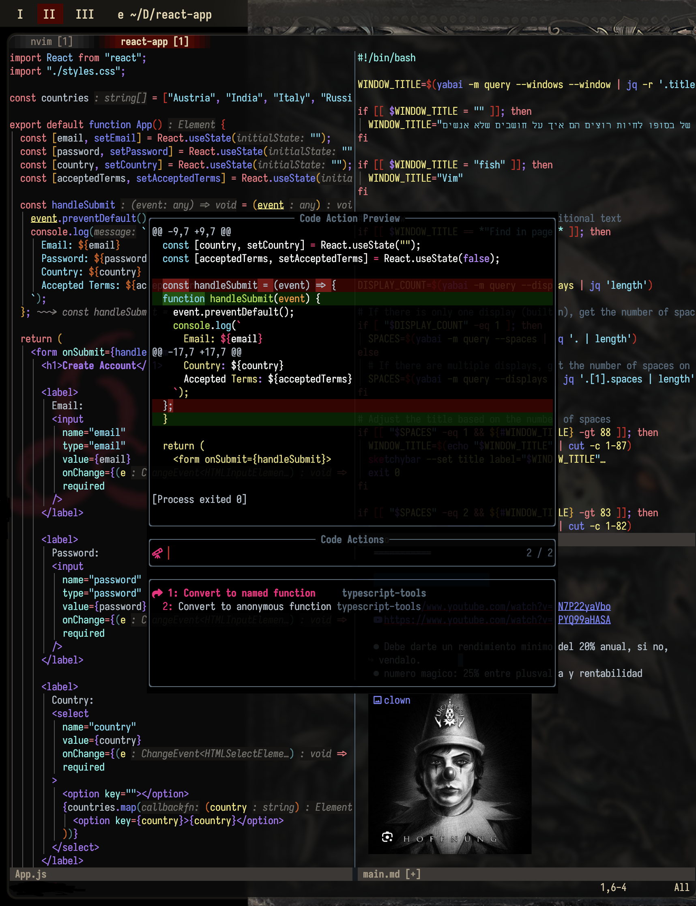

# Sergiornelas Neovim

<div align="center">

[]()
[]()
[](https://github.com/neovim/neovim)
<br>
<a href="https://dotfyle.com/sergiornelas/nvim"></a>
<a href="https://dotfyle.com/sergiornelas/nvim"></a>
<a href="https://dotfyle.com/sergiornelas/nvim"></a>

</div>

## Showcase




## Install Instructions

 > Install requires Neovim 0.9+. Always review the code before installing a configuration.

Clone the repository and install the plugins:

```sh
git clone git@github.com:sergiornelas/nvim ~/.config/sergiornelas/nvim
```

Open Neovim with this config:

```sh
NVIM_APPNAME=sergiornelas/nvim/ nvim
```

## Plugins

### ai

+ [nickjvandyke/opencode.nvim](https://dotfyle.com/plugins/nickjvandyke/opencode.nvim)
+ [supermaven-inc/supermaven-nvim](https://dotfyle.com/plugins/supermaven-inc/supermaven-nvim)

### animation

+ [rachartier/tiny-glimmer.nvim](https://dotfyle.com/plugins/rachartier/tiny-glimmer.nvim)

### bars-and-lines

+ [lukas-reineke/virt-column.nvim](https://dotfyle.com/plugins/lukas-reineke/virt-column.nvim)
+ [SmiteshP/nvim-navic](https://dotfyle.com/plugins/SmiteshP/nvim-navic)

### code-runner

+ [CRAG666/code_runner.nvim](https://dotfyle.com/plugins/CRAG666/code_runner.nvim)

### color

+ [brenoprata10/nvim-highlight-colors](https://dotfyle.com/plugins/brenoprata10/nvim-highlight-colors)

### colorscheme

+ [thesimonho/kanagawa-paper.nvim](https://dotfyle.com/plugins/thesimonho/kanagawa-paper.nvim)
+ [Mofiqul/vscode.nvim](https://dotfyle.com/plugins/Mofiqul/vscode.nvim)
+ [craftzdog/solarized-osaka.nvim](https://dotfyle.com/plugins/craftzdog/solarized-osaka.nvim)
+ [ellisonleao/gruvbox.nvim](https://dotfyle.com/plugins/ellisonleao/gruvbox.nvim)
+ [ribru17/bamboo.nvim](https://dotfyle.com/plugins/ribru17/bamboo.nvim)
+ [scottmckendry/cyberdream.nvim](https://dotfyle.com/plugins/scottmckendry/cyberdream.nvim)
+ [AlexvZyl/nordic.nvim](https://dotfyle.com/plugins/AlexvZyl/nordic.nvim)
+ [folke/tokyonight.nvim](https://dotfyle.com/plugins/folke/tokyonight.nvim)
+ [navarasu/onedark.nvim](https://dotfyle.com/plugins/navarasu/onedark.nvim)
+ [eldritch-theme/eldritch.nvim](https://dotfyle.com/plugins/eldritch-theme/eldritch.nvim)
+ [vague-theme/vague.nvim](https://dotfyle.com/plugins/vague-theme/vague.nvim)
+ [ficcdaf/ashen.nvim](https://dotfyle.com/plugins/ficcdaf/ashen.nvim)
+ [datsfilipe/vesper.nvim](https://dotfyle.com/plugins/datsfilipe/vesper.nvim)
+ [loctvl842/monokai-pro.nvim](https://dotfyle.com/plugins/loctvl842/monokai-pro.nvim)
+ [catppuccin/nvim](https://dotfyle.com/plugins/catppuccin/nvim)
+ [0xstepit/flow.nvim](https://dotfyle.com/plugins/0xstepit/flow.nvim)
+ [guillermodotn/nvim-earthsong](https://dotfyle.com/plugins/guillermodotn/nvim-earthsong)
+ [rose-pine/neovim](https://dotfyle.com/plugins/rose-pine/neovim)
+ [rebelot/kanagawa.nvim](https://dotfyle.com/plugins/rebelot/kanagawa.nvim)
+ [sainnhe/edge](https://dotfyle.com/plugins/sainnhe/edge)
+ [everviolet/nvim](https://dotfyle.com/plugins/everviolet/nvim)
+ [sainnhe/gruvbox-material](https://dotfyle.com/plugins/sainnhe/gruvbox-material)
+ [EdenEast/nightfox.nvim](https://dotfyle.com/plugins/EdenEast/nightfox.nvim)

### comment

+ [folke/ts-comments.nvim](https://dotfyle.com/plugins/folke/ts-comments.nvim)

### completion

+ [saghen/blink.cmp](https://dotfyle.com/plugins/saghen/blink.cmp)

### editing-support

+ [windwp/nvim-autopairs](https://dotfyle.com/plugins/windwp/nvim-autopairs)
+ [okuuva/auto-save.nvim](https://dotfyle.com/plugins/okuuva/auto-save.nvim)
+ [nvim-treesitter/nvim-treesitter-context](https://dotfyle.com/plugins/nvim-treesitter/nvim-treesitter-context)
+ [windwp/nvim-ts-autotag](https://dotfyle.com/plugins/windwp/nvim-ts-autotag)
+ [andersevenrud/nvim_context_vt](https://dotfyle.com/plugins/andersevenrud/nvim_context_vt)
+ [folke/snacks.nvim](https://dotfyle.com/plugins/folke/snacks.nvim)

### formatting

+ [stevearc/conform.nvim](https://dotfyle.com/plugins/stevearc/conform.nvim)
+ [lewis6991/spaceless.nvim](https://dotfyle.com/plugins/lewis6991/spaceless.nvim)

### game

+ [seandewar/killersheep.nvim](https://dotfyle.com/plugins/seandewar/killersheep.nvim)

### git

+ [lewis6991/gitsigns.nvim](https://dotfyle.com/plugins/lewis6991/gitsigns.nvim)

### lsp

+ [rachartier/tiny-code-action.nvim](https://dotfyle.com/plugins/rachartier/tiny-code-action.nvim)
+ [rachartier/tiny-inline-diagnostic.nvim](https://dotfyle.com/plugins/rachartier/tiny-inline-diagnostic.nvim)
+ [kosayoda/nvim-lightbulb](https://dotfyle.com/plugins/kosayoda/nvim-lightbulb)
+ [neovim/nvim-lspconfig](https://dotfyle.com/plugins/neovim/nvim-lspconfig)

### markdown-and-latex

+ [iamcco/markdown-preview.nvim](https://dotfyle.com/plugins/iamcco/markdown-preview.nvim)
+ [OXY2DEV/markview.nvim](https://dotfyle.com/plugins/OXY2DEV/markview.nvim)

### marks

+ [cbochs/grapple.nvim](https://dotfyle.com/plugins/cbochs/grapple.nvim)

### media

+ [HakonHarnes/img-clip.nvim](https://dotfyle.com/plugins/HakonHarnes/img-clip.nvim)

### plugin-manager

+ [folke/lazy.nvim](https://dotfyle.com/plugins/folke/lazy.nvim)

### programming-languages-support

+ [dmmulroy/ts-error-translator.nvim](https://dotfyle.com/plugins/dmmulroy/ts-error-translator.nvim)
+ [dmmulroy/tsc.nvim](https://dotfyle.com/plugins/dmmulroy/tsc.nvim)

### quickfix

+ [stevearc/quicker.nvim](https://dotfyle.com/plugins/stevearc/quicker.nvim)
+ [kevinhwang91/nvim-bqf](https://dotfyle.com/plugins/kevinhwang91/nvim-bqf)

### search

+ [kevinhwang91/nvim-hlslens](https://dotfyle.com/plugins/kevinhwang91/nvim-hlslens)

### session

+ [rmagatti/auto-session](https://dotfyle.com/plugins/rmagatti/auto-session)

### snippet

+ [rafamadriz/friendly-snippets](https://dotfyle.com/plugins/rafamadriz/friendly-snippets)
+ [L3MON4D3/LuaSnip](https://dotfyle.com/plugins/L3MON4D3/LuaSnip)

### statusline

+ [nvim-lualine/lualine.nvim](https://dotfyle.com/plugins/nvim-lualine/lualine.nvim)

### syntax

+ [nvim-treesitter/nvim-treesitter](https://dotfyle.com/plugins/nvim-treesitter/nvim-treesitter)
+ [nvim-treesitter/nvim-treesitter-textobjects](https://dotfyle.com/plugins/nvim-treesitter/nvim-treesitter-textobjects)
+ [kylechui/nvim-surround](https://dotfyle.com/plugins/kylechui/nvim-surround)

### test

+ [nvim-neotest/neotest](https://dotfyle.com/plugins/nvim-neotest/neotest)

### utility

+ [echasnovski/mini.nvim](https://dotfyle.com/plugins/echasnovski/mini.nvim)
+ [mcauley-penney/visual-whitespace.nvim](https://dotfyle.com/plugins/mcauley-penney/visual-whitespace.nvim)

### web-development

+ [mawkler/jsx-element.nvim](https://dotfyle.com/plugins/mawkler/jsx-element.nvim)

## Language Servers

+ cssls
+ eslint
+ html
+ jsonls
+ lua_ls
+ vtsls
+ yamlls
